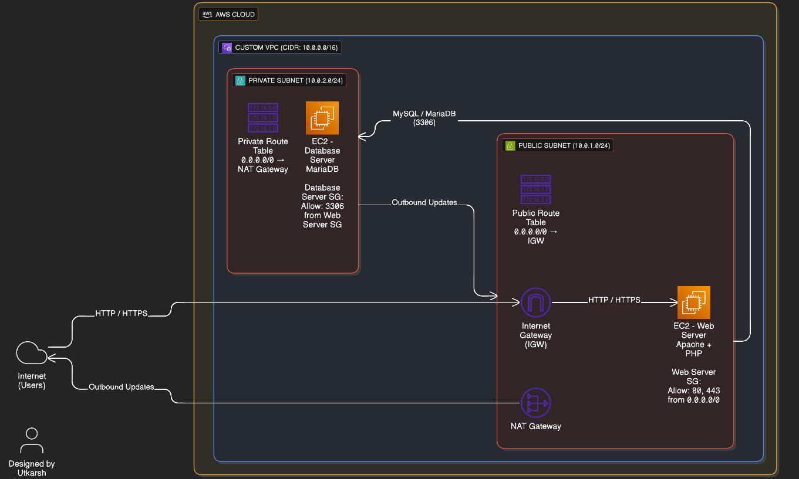
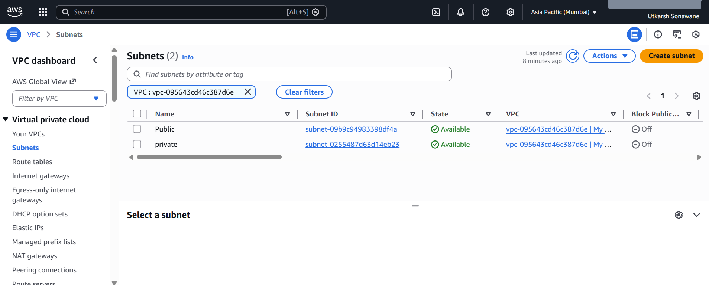
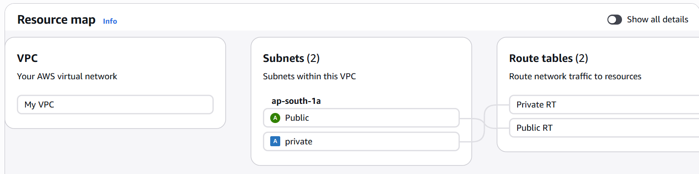
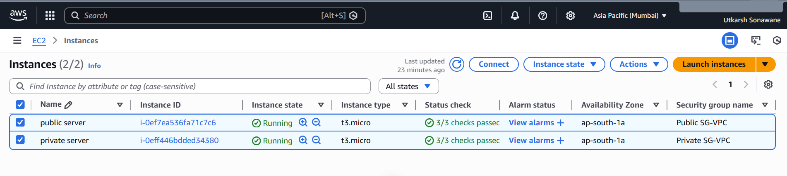
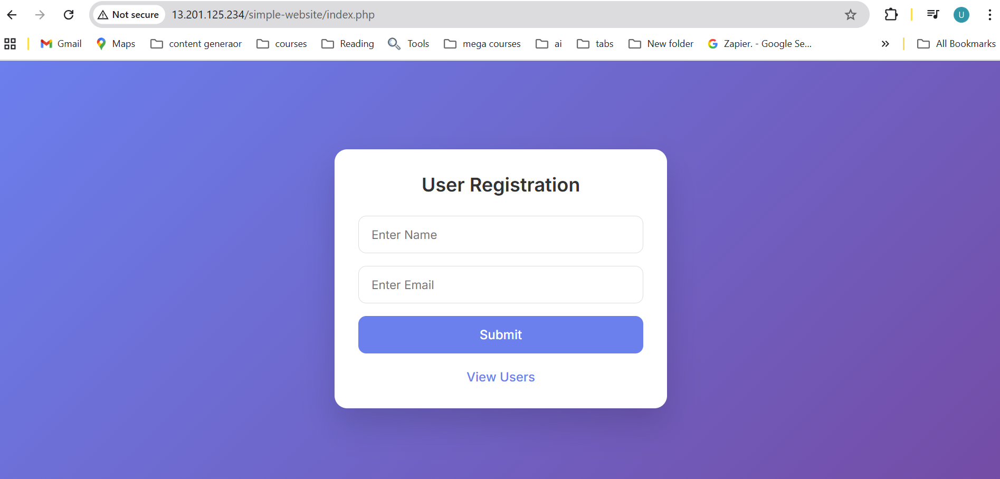
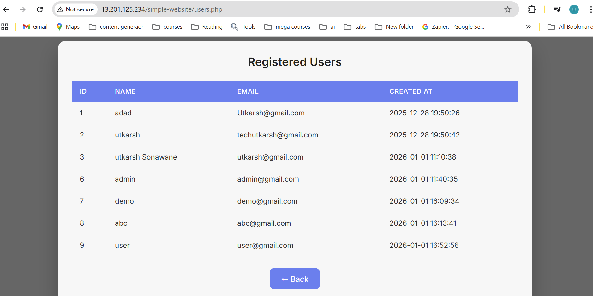

# AWS VPC Two-Tier PHP Application with MariaDB
A secure AWS two-tier PHP stack utilizing a custom VPC, public/private subnet isolation, and an IGW/NAT Gateway configuration. Features a PHP-driven Web Tier and a private MariaDB Database Tier hosted on EC2 for enhanced data security to ensure isolation.The architecture reflects real-world scenarios where databases are isolated from direct internet access.

## Architecture
- Custom VPC
- Public Subnet (EC2 – Web Tier)
- Private Subnet (EC2 – Database Tier with MariaDB)
- Internet Gateway for public access
- NAT Gateway for outbound internet access from private subnet
- Route Tables for traffic control

  ## Architecture Diagram

## AWS Services Used
- Amazon VPC
- Amazon EC2
- Internet Gateway
- NAT Gateway
- Route Tables
- Security Groups

## Technology Stack
- Apache Web Server
- PHP
- MariaDB
- Linux (Amazon Linux)

## Security Design
- Web server EC2 is accessible via Internet Gateway
- Database EC2 is deployed in a private subnet with no public IP
- Security Groups allow database access only from the web server EC2
- NAT Gateway enables outbound internet access for the private subnet

## Application
- PHP web application hosted on EC2
- Connects securely to MariaDB running on a private EC2 instance
- Demonstrates data insertion and retrieval

## Key Learnings
- Designing VPCs with public and private subnets
- Deploying and securing databases in private networks
- Configuring Internet and NAT Gateways
- Implementing AWS networking best practices

## 📸 Project Screenshots

### VPC & Networking Setup

### EC2 Instances

### Web Application

### Database Validation

## 📜 EC2 Setup Commands

This project includes documented, reproducible setup commands for both web and database EC2 instances.

👉 [EC2 Setup Commands (commands.md)](commands.md)

